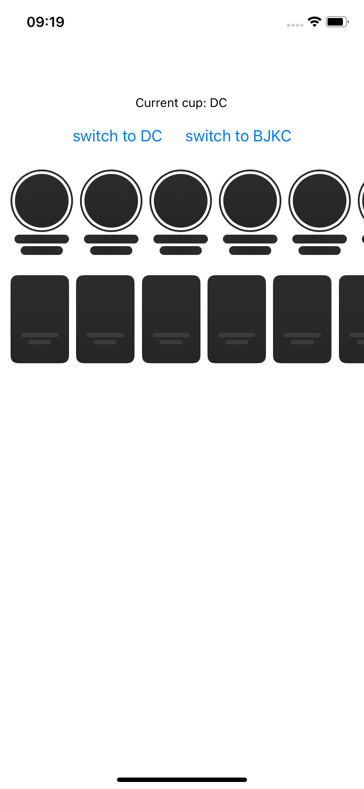

## Run the app

0. create a .env file with the following content:

```
EXPO_PUBLIC_STORY_TELLER_API_KEY_IOS=
EXPO_PUBLIC_STORY_TELLER_API_KEY_ANDROID=
```

1. npm install
2. npx expo prebuild
3. npx expo run:android
4. npx expo run:ios
5. npx expo start

## 1 issue - Android - build fails

### Solution:

patch package + expo config plugin

```ts
diff --git a/node_modules/@getstoryteller/react-native-storyteller-sdk/android/build.gradle b/node_modules/@getstoryteller/react-native-storyteller-sdk/android/build.gradle
index 8930bda..fcc63bc 100644
--- a/node_modules/@getstoryteller/react-native-storyteller-sdk/android/build.gradle
+++ b/node_modules/@getstoryteller/react-native-storyteller-sdk/android/build.gradle
@@ -19,6 +19,7 @@ buildscript {
 apply from: 'compose-versions.gradle'
 apply plugin: 'com.android.library'
 apply plugin: 'kotlin-android'
+apply plugin: 'org.jetbrains.kotlin.plugin.compose'

 def getExtOrDefault(name) {
   return rootProject.ext.has(name) ? rootProject.ext.get(name) : project.properties['StorytellerSdk_' + name]

```

## 2 issue - iOS - content is not loading correctly



## 3 issue - Android - content can disappear with conditionnal rendering


### side note:

- on the main app, conditionnal rendering can crash the app

```
2025-07-07 16:14:39.721 11242-11242 AndroidRuntime          com.i<ID>           E  FATAL EXCEPTION: main (Ask Gemini)
                                                                                                   Process: com.<ID>, PID: 11242
                                                                                                   java.lang.IllegalArgumentException: No view found for id 0x177 (unknown) for fragment StorytellerSdkStoriesRowFragment{990c31e} (f7658bf6-a285-45a9-ab46-7508bc33bd83 id=0x177 tag=375)
                                                                                                   	at androidx.fragment.app.FragmentStateManager.createView(FragmentStateManager.java:567)
                                                                                                   	at androidx.fragment.app.FragmentStateManager.moveToExpectedState(FragmentStateManager.java:286)
                                                                                                   	at androidx.fragment.app.FragmentManager.executeOpsTogether(FragmentManager.java:2214)
                                                                                                   	at androidx.fragment.app.FragmentManager.removeRedundantOperationsAndExecute(FragmentManager.java:2109)
                                                                                                   	at androidx.fragment.app.FragmentManager.execPendingActions(FragmentManager.java:2052)
                                                                                                   	at androidx.fragment.app.FragmentManager$5.run(FragmentManager.java:703)
                                                                                                   	at android.os.Handler.handleCallback(Handler.java:991)
                                                                                                   	at android.os.Handler.dispatchMessage(Handler.java:102)
                                                                                                   	at android.os.Looper.loopOnce(Looper.java:232)
                                                                                                   	at android.os.Looper.loop(Looper.java:317)
                                                                                                   	at android.app.ActivityThread.main(ActivityThread.java:8787)
                                                                                                   	at java.lang.reflect.Method.invoke(Native Method)
                                                                                                   	at com.android.internal.os.RuntimeInit$MethodAndArgsCaller.run(RuntimeInit.java:591)
                                                                                                   	at com.android.internal.os.ZygoteInit.main(ZygoteInit.java:871)
```

# storyteller-expo-example
